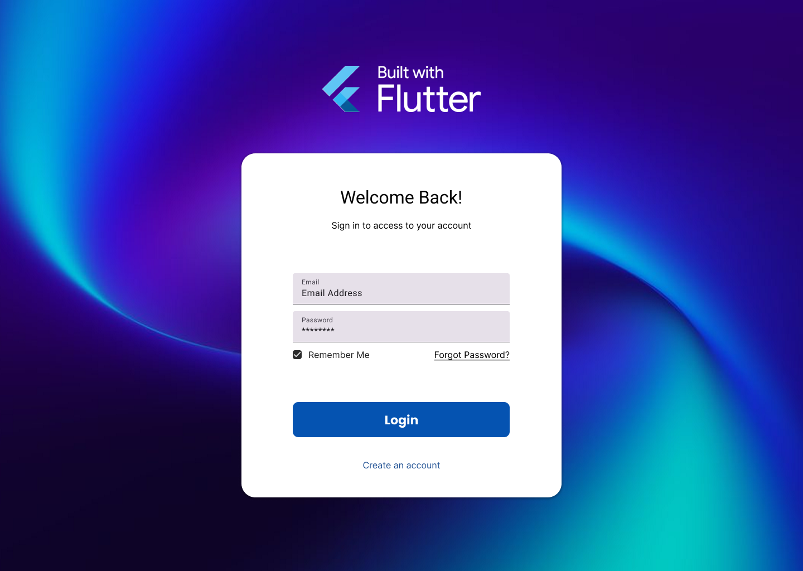

<div style="background-color: #0553B1; color: white; text-align: center; padding: 20px;">
    <h1>Demo Project - Order Management System</h1>
</div>

---

# Table of Contents

- [Table of Contents](#table-of-contents)
  - [Introduction](#introduction)
  - [Project Structure](#project-structure)
    - [1. Login Screen](#1-login-screen)
    - [2. Dashboard Screen](#2-dashboard-screen)
  - [Getting Started](#getting-started)
  - [Testing Credentials](#testing-credentials)
  - [Resources](#resources)

---

## Introduction

This project demonstrates a simple order management system built with Flutter, featuring authentication, real-time data synchronization with Firebase, and location visualization using Google Maps. The application consists of two main screens: a Login page and a Dashboard page.

Before starting, please review the [UI Reference Guide](tutorials/ui_reference.md) which contains detailed explanations of Flutter widgets and components used throughout this project.

## Project Structure

### 1. Login Screen

The Login Screen serves as the primary entry point to the application and provides user authentication functionality.



| Functionality Features | UI Design & Widgets |
|----------|-------------------|
| • Authentication gateway | • Container with image background |
| • Custom background with logo | • Card widget with elevation and rounded corners |
| • Email and password input fields | • TextFormField widgets with InputDecoration |
| • "Remember Me" checkbox | • Checkbox widget with custom theme |
| • Forgot password option | • ElevatedButton with custom styling |
| • Create new account button | • Image widget for logo display |
| | • Column and Row layouts for alignment |

### 2. Dashboard Screen

The Dashboard Screen is the main operational hub of the application, providing a comprehensive overview of order statistics and management capabilities. It features a responsive design that adapts to different screen sizes and offers real-time data visualization along with interactive map functionality for order tracking.

|  | |
|--------------------------------|---------|

| Functionality Features | UI Design & Widgets |
|----------|-------------------|
| • Real-time statistics using Firebase Firestore | • Scaffold with responsive layout |
| • Order list with status indicators | • AppBar with custom actions |
| • Google Maps integration | • Drawer widget with navigation items |
| • Responsive design support | • Card widgets for statistics display |
| • Side drawer functionality | • ListView.builder for order list |
| | • GoogleMap widget with markers |
| | • CircularProgressIndicator for loading states |


## Getting Started

1. Review the [UI Reference Guide](tutorials/ui_reference.md) for your reference.
2. Create a Flutter project in your [Project IDX](https://idx.dev/).
3. Follow the [Login Screen Walkthrough](tutorials/login_walkthrough.md) to create Login page step by step.
4. Complete the [Dashboard Screen Walkthrough](tutorials/dashboard_walkthrough.md) to have a full running WebApp.
5. Read through the [Dashboard Screen Explanation](tutorials/dashboard_explanations.md) for detailed explanation on the codes and concepts in the Dashboard screen.

## Testing Credentials
```
Email: admin
Password: root
```

## Resources

- Main Resources

    | Resource | Link |
    |----------|------|
    | Figma Design | [Order Management System UI](https://www.figma.com/design/yU1AdQLXjaeCcB0txnIlXW/Flutter-UI-Design-Workshop?node-id=179-136&t=5HALit4xttZgAwjr-1) |
    | App Logo | [assets/logo.png](assets/logo.png) |
    | Login Background | [assets/login_bg.png](assets/login_bg.png) |


- Additional Resources

  - [Flutter Official Documentation](https://flutter.dev/docs)
  - [Firebase Flutter Setup](https://firebase.google.com/docs/flutter/setup)
  - [Google Maps Flutter Plugin](https://pub.dev/packages/google_maps_flutter)
