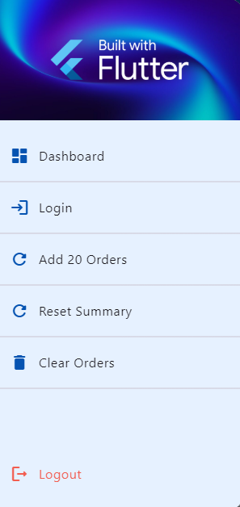
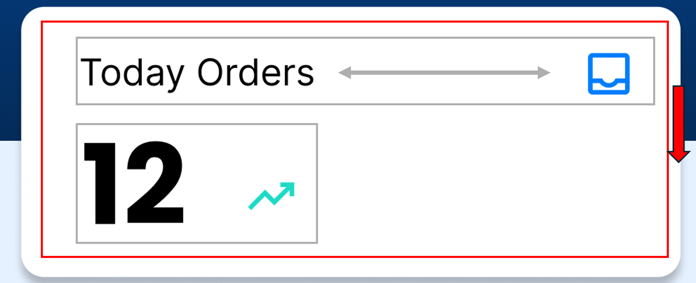

<div style="background-color: #215294; color: white; text-align: center; padding: 20px;">
    <h1>Building Dashboard Page Step by Step</h1>
</div>

---

### This guide explain the code and concepts used in the Dashboard Page in detail.

---

## Table of Contents

1. [DRY (Don't Repeat Yourself)](#1-dry-dont-repeat-yourself)
2. [Structure](#2-structure)
3. [Drawer](#3-drawer)
4. [AppBar](#4-appbar)
5. [Main Layout of the Page](#5-main-layout-of-the-page)
6. [Main Widgets - Overview Widget](#6-main-widgets---overview-widget)
7. [Statistics Cards - StreamBuilder & SummaryCards](#7-statistics-cards---streambuilder--summarycards)
8. [Main Widgets - Details Widgets](#8-main-widgets---details-widgets)
9. [OrderList](#9-orderlist)
10. [Google Map](#10-google-map)
    
- [Action Functions](#-Action-Functions)
---

It is also assumed you have already imported `material` package and created a `StatefulWidget` named `DashboadPage` from the previous tutorials. if you haven't, please do the needful and continue with the rest below.


## 1. DRY (Don't Repeat Yourself)

The DRY principle emphasizes the importance of reducing repetition in code. By defining constants for colors and padding, we ensure consistency and make future updates easier. We add those that used repeatedly throughout the file variables at the beginning of the file, Here are the constants we are adding:

- Color constants
- Padding constants (EdgeInsets) for mobile/desktop

```dart
static const Color primaryColor = Color(0xff0553B1);
static const Color secondaryColor = Color(0xff042B59);
static const Color accentColor = Color(0xffF57C00);
static const Color iconColor = Color(0xff027DFD);
static const Color greenColor = Color(0xff1CDAC5);
static const Color redColor = Color(0xffF25D50);
static const Color backgroundColor = Color(0xffE6F1FF);

static const EdgeInsets mobilePadding = EdgeInsets.fromLTRB(20, 20, 20, 0);
static const EdgeInsets desktopPadding = EdgeInsets.fromLTRB(75, 30, 75, 0);
```

## 2. Structure
Set up the basic structure using `Scaffold`.

```dart
class _DashboardPageState extends State<DashboardPage> {
    @override
    Widget build(BuildContext context) {
        return Scaffold(
            backgroundColor: backgroundColor,
            body: Container(),
        );
    }
}
```


## 3. Drawer



The `Drawer` is a slide-in menu typically used for navigation within an app. It can contain a variety of widgets, such as `ListTile` for navigation options, images, and other UI elements.

### 3.1 Creating the Drawer Function
To keep the code organized and maintainable, we create a separate function named `ourDrawer()` that returns a `Drawer` widget. 

The `Drawer` widget has several key parameters, such as `backgroundColor`, which sets the background color of the drawer, and `child`, which is a widget that defines the content of the drawer. Inside the `child`, we use a `Column` widget to organize the various elements vertically.

In our code, we added the following elements inside the `Drawer`:

- **Logo Section**: A `Container` with a background image and a centered logo.
- **Menu Items**: A series of `ListTile` widgets for navigation options like Dashboard and Login, each with an icon and a title.
- **Line Dividers**: `Divider` widgets to separate the menu items visually.
- **Spacer**: A `Spacer` widget to push the logout option to the bottom of the drawer.
- **Logout Option**: A `ListTile` widget for the logout option, styled with a red color.

This structure ensures that the drawer is both functional and visually appealing, providing a clear and organized navigation experience for the user.

```dart
Widget ourDrawer() {
    return Drawer(
      backgroundColor: backgroundColor,
      child: Column(
        children: [
          // Logo Section
          Container(
            height: 150,
            width: double.infinity,
            padding: const EdgeInsets.all(20),
            decoration: const BoxDecoration(
              image: DecorationImage(
                image: AssetImage('/login_bg.png'),
                fit: BoxFit.cover,
                opacity: 0.3,
              ),
              color: Colors.black,
            ),
            child: Center(
              child: Image.asset('/logo.png', height: 50),
            ),
          ),
          const SizedBox(height: 20),

          // Menu Items

          // Dashboard
          ListTile(
            leading: const Icon(Icons.dashboard_rounded, color: primaryColor),
            title: const Text('Dashboard'),
            onTap: () {
              Navigator.push(
                context,
                MaterialPageRoute(
                  builder: (context) => const DashboardPage(),
                ),
              );
            },
          ),

          // Line Divider
          const Divider(),

          // Login
          ListTile(
            leading: const Icon(Icons.login_rounded, color: primaryColor),
            title: const Text('Login'),
            onTap: () {
              Navigator.push(
                context,
                MaterialPageRoute(
                  builder: (context) => const LoginPage(),
                ),
              );
            },
          ),

          // Line Divider
          const Divider(),

          // Add 20 Order Data
          ListTile(
            leading: const Icon(Icons.refresh_rounded, color: primaryColor),
            title: const Text('Add 20 Orders'),
            onTap: () {
              twentyDummyData();
            },
          ),

          // Line Divider
          const Divider(),

          // Reset Summary
          ListTile(
            leading: const Icon(Icons.refresh_rounded, color: primaryColor),
            title: const Text('Reset Summary'),
            onTap: () {
              resetSummary();
            },
          ),

          // Line Divider
          const Divider(),

          // Clear Orders
          ListTile(
            leading: const Icon(Icons.delete_rounded, color: primaryColor),
            title: const Text('Clear Orders'),
            onTap: () {
              clearOrders();
            },
          ),

          // Line Divider
          const Divider(),

          // Spacer to push logout to bottom
          const Spacer(),

          // Logout at bottom
          ListTile(
            leading: const Icon(Icons.logout_rounded, color: Color(0xffF25D50)),
            title: const Text(
              'Logout',
              style: TextStyle(color: Color(0xffF25D50)),
            ),
            onTap: () {
              Navigator.pushReplacement(
                context,
                MaterialPageRoute(
                  builder: (context) => const LoginPage(),
                ),
              );
            },
          ),

          const SizedBox(height: 20),
        ],
      ),
    );
}
```

### 3.2 Adding Drawer to Scaffold

Now that we have the `ourDrawer()` function, we can add it to the `Scaffold` widget.

```dart
class _DashboardPageState extends State<DashboardPage> {
    @override
    Widget build(BuildContext context) {
        return Scaffold(
            backgroundColor: backgroundColor,
            // Drawer Menu
            drawer: ourDrawer(),
            // Body of Scaffold
            body: Container(),
        );
    }
}
```
Drawer in Flutter cannot open itself automatically without some form of user interaction or programmatic trigger. Therefore, will we need a button in header to open this. This will be achieved in `AppBar` next.

## 4. AppBar


The `AppBar` is a material design app bar that can be used to display a title, navigation icons, and other actions. It is typically used in the `Scaffold` widget to provide a consistent header across different screens of the app.

### 4.1 Styling

Use properties like `elevation` or `backgroundColor` to style the `AppBar`.

```dart
class _DashboardPageState extends State<DashboardPage> {
    @override
    Widget build(BuildContext context) {
        return Scaffold(
            backgroundColor: backgroundColor,
            // Drawer Menu
            drawer: drawer(),
            // App Bar
            appBar: AppBar(
                elevation: 3,
                backgroundColor: primaryColor,
            ),
            // Body of Scaffold
            body: Container(),
        );
    }
}
```

### 4.2 Title

To add a title to the `AppBar`, use the `title` property. The title is usually a `Text` widget that describes the current screen.

```dart
appBar: AppBar(
    elevation: 3,
    backgroundColor: primaryColor,
    title: const Text("Dashboard", style: TextStyle(color: Colors.white)),
),
```

### 4.3 Menu Button

To add a menu button to the `AppBar` (for example, to open the drawer), use the `leading` property, which typically contains an `IconButton`. We use a `Builder` widget to create the button. The `Builder` lets us access the `Scaffold's context`, which is necessary to open the `drawer` that we assigned to `Scaffold` earlier, programmatically.

```dart
leading: Builder(
    // Builder to access Scaffold context
    builder: (context) {
        return IconButton(
            icon: const Icon(Icons.menu_rounded, color: Colors.white),
            onPressed: () {
                // Open Drawer programmatically
                Scaffold.of(context).openDrawer();
            },
        );
    },
),
```

### 4.4 Action Buttons

To add action buttons (buttons on the right side of the `AppBar`), use the `actions` property, which takes a list of widgets. Here we add two buttons: refresh and log out.

- The log out button navigates us back to the login screen. We use the `Navigator.pushReplacement` method instead of `Navigator.push`. This method replaces the current route with the new one, ensuring users cannot return to the previous screen.
- We will explain the usage and implementation of the refresh button later when we go through the `FutureBuilder`.

```dart
actions: [
    // Refresh Button
    IconButton(
        icon: const Icon(Icons.refresh_rounded, color: Colors.white),
        onPressed: () {
            // Simply refreshes the page by setting a new state that forces a rebuild
            setState(() {});
        },
    ),
    const SizedBox(width: 10),
    // Logout Button
    IconButton(
        icon: const Icon(Icons.logout_rounded, color: Colors.white),
        onPressed: () {
            // Navigate to Login Page
            Navigator.pushReplacement(
                context,
                MaterialPageRoute(
                    builder: (context) => const LoginPage(),
                ),
            );
        },
    ),
    // To separate buttons from the right edge
    const SizedBox(width: 10),
],
```

## 5. Main Layout of the Page


The layout of the page is defined in the `body` of the `Scaffold`. We use a `Container` to take up the full screen width and height, with consideration for the `AppBar` height. To achieve this, we use `MediaQuery.of(context).size.height - 60`.

To promote modular programming, we write functions outside of the `build` method to handle different sections of the layout easily.

```dart
body: Container(
    width: MediaQuery.of(context).size.width,
    height: MediaQuery.of(context).size.height - 60,
    child: Column(
        mainAxisAlignment: MainAxisAlignment.start,
        crossAxisAlignment: CrossAxisAlignment.center,
        children: [
            overview(),
            Expanded(child: details()),
        ],
    ),
),
```

## 6. Main Widgets - Overview Widget

The `overview` widget provides a greeting and summary statistics. We use a `Stack` to layer widgets on top of each other. The `Stack` widget allows us to place the background gradient and the foreground content.

### 6.1 Stacking

Stacking is achieved using the `Stack` widget in Flutter, which allows overlaying widgets on top of each other.
- A `Container` with a gradient background is used to create a visually appealing background.
  - the height of this container is wisely chosen to ensure the end of the container is half of the cards.
  - The gradient is achieved using the `BoxDecoration`, and using the `gradient` property, with the `LinearGradient` property. `LinearGradient` will take list of colors, and parameters such as `being` or `end` or organize the gradient direction.
- Another `Container` is used for the foreground content, which includes text and button, and statistic cards.
  - Text and button are organized using the `Row` widget to arrange them horizontally.
- Statistics cards are written in a separate function to promote modularity and avoid having a long function.
```dart
Widget overview() {
    return Stack(
      children: [
        // Background Gradient
        Container(
          width: double.infinity,
          height: MediaQuery.of(context).size.width < 800 ? 150 : 160,
          decoration: const BoxDecoration(
            gradient: LinearGradient(
              colors: [primaryColor, secondaryColor],
              begin: Alignment.topCenter,
              end: Alignment.bottomCenter,
            ),
          ),
        ),
        // Foreground Content
        Container(
          width: double.infinity,
          padding: MediaQuery.of(context).size.width < 800
              ? mobilePadding
              : desktopPadding,
          child: Column(
            mainAxisAlignment: MainAxisAlignment.start,
            crossAxisAlignment: CrossAxisAlignment.start,
            children: [
              // Row with Welcome Text and New Order Button
              Row(
                mainAxisAlignment: MainAxisAlignment.spaceBetween,
                crossAxisAlignment: CrossAxisAlignment.center,
                children: [
                  // Greeting Text
                  const Text(
                    "Welcome Back!",
                    style: TextStyle(
                      fontSize: 24,
                      fontWeight: FontWeight.bold,
                      color: Colors.white,
                    ),
                  ),
                  // Add New order Button
                  ElevatedButton(
                    style: ElevatedButton.styleFrom(
                      backgroundColor: accentColor,
                      shape: RoundedRectangleBorder(
                        borderRadius: BorderRadius.circular(5),
                      ),
                    ),
                    onPressed: () {
                      // Action to add 1 dummy data to Firestore
                      addDummyData();
                    },
                    // If screen width is for desktop, show icon, else show text
                    child: MediaQuery.of(context).size.width < 800
                        ? const Icon(
                            Icons.add_rounded,
                            color: Colors.white,
                          )
                        : const Text(
                            'New Order',
                            style: TextStyle(color: Colors.white),
                          ),
                  ),
                ],
              ),
              // Spacer
              const SizedBox(height: 20),
              // Statistics Cards
              statisticsCards(),
            ],
          ),
        ),
      ],
    );
  }
```

## 7. Statistics Cards - StreamBuilder & SummaryCards
### 7.1 Initializing Firebase Instance

Before using Firestore in our file, we need to initialize the Firebase instance. This is done by creating an instance of `FirebaseFirestore` at the beginning of the file. This instance will be used to interact with the Firestore database throughout the file.
```dart
// Firebase Instance
FirebaseFirestore firestore = FirebaseFirestore.instance;
```

### 7.2 StreamBuilder

The `StreamBuilder` widget is used to when we to listen to real-time updates from a Data source. It rebuilds its content whenever new data is available, ensuring that the UI stays up-to-date with the latest information.

In our code, we use `StreamBuilder` to fetch summary data from the 'summaries' collection in Firestore. The `stream` parameter takes a Firestore stream, which listens for changes in the specified document. The `builder` function handles different states of the stream, such as data availability, errors, and loading.

- The `StreamBuilder` widget can handle different states such as success, failure, and loading. These states are crucial for providing a responsive and user-friendly UI.

    - **Success State**: When the data is successfully fetched, the `StreamBuilder` rebuilds the UI with the new data. This ensures that the UI is always up-to-date with the latest information.
    - **Failure State**: If there is an error while fetching the data, the `StreamBuilder` can display an error message. This helps in debugging and provides feedback to the user.
    - **Loading State**: While the data is being fetched, the `StreamBuilder` can display a loading indicator. This informs the user that the data is being loaded and prevents the UI from appearing unresponsive.

- To create a responsive layout that adapts to different screen sizes, we use the `Row` and `Expanded` widgets.

    - **Mobile Layout**: For mobile screens, we use a single `Row` with an `Expanded` widget to ensure the card takes up the full width of the screen. This makes the content easily readable on smaller screens.
    - **Desktop Layout**: For larger screens, we use a `Row` with multiple `Expanded` widgets. Each `Expanded` widget takes up an equal portion of the available width, creating a balanced and organized layout.

- The `CircularProgressIndicator` widget is used to display a loading spinner while data is being fetched. It provides a visual indication to the user that the app is busy and prevents the UI from appearing frozen.

```dart
    Widget statisticsCards() {
        // StreamBuilder to get summary data from Firestore -> Realtime updates
        return StreamBuilder<DocumentSnapshot<Map<String, dynamic>>>(
                // Stream to listen to changes in Firestore in realtime
                stream: firestore.collection('summaries').doc('summary').snapshots(),
                // Builder to handle different states of the stream
                builder: (context, snapshot) {
                    // If data is available
                    if (snapshot.hasData) {
                        // Get data from snapshot
                        // Since 1 document, Data is in the form of a Map with keys as field names
                        var order = snapshot.data!.data();
                        // If reading is successful but no data is available
                        if (order == null) {
                            return const Center(
                                child: Text(
                                    "No summary data available",
                                    style: TextStyle(color: Colors.white),
                                ),
                            );
                        }
                        return (MediaQuery.of(context).size.width < 800)
                                ?
                                // Use Row and Expanded for full width
                                Row(
                                        children: [
                                            // Total Orders
                                            Expanded(
                                                child: summaryCard(
                                                    Icons.inbox_rounded,
                                                    'Todtal Orders',
                                                    order['total'],
                                                ),
                                            ),
                                        ],
                                    )
                                : Row(
                                        mainAxisAlignment: MainAxisAlignment.start,
                                        crossAxisAlignment: CrossAxisAlignment.center,
                                        // Use Expanded without flex to divide space equally
                                        children: [
                                            // Today Orders
                                            Expanded(
                                                child: summaryCard(
                                                    Icons.inbox_rounded,
                                                    'Today Orders',
                                                    order['today'],
                                                ),
                                            ),
                                            const SizedBox(width: 20),
                                            // Total Orders
                                            Expanded(
                                                child: summaryCard(
                                                    Icons.inventory_2_rounded,
                                                    'Total Orders',
                                                    order['total'],
                                                ),
                                            ),
                                            const SizedBox(width: 20),
                                            // Delivered Orders
                                            Expanded(
                                                child: summaryCard(
                                                    Icons.local_shipping_rounded,
                                                    'Delivered',
                                                    order['delivered'],
                                                ),
                                            ),
                                            const SizedBox(width: 20),
                                            // Customers
                                            Expanded(
                                                child: summaryCard(
                                                    Icons.groups_2_rounded,
                                                    'Customers',
                                                    order['customers'],
                                                ),
                                            ),
                                        ],
                                    );
                    }
                    // If failed to retrieve data
                    if (snapshot.hasError) {
                        return const Text("Error loading data");
                    }
                    // Default Loading until a decision is made
                    return const Center(
                        child: CircularProgressIndicator(color: Colors.white),
                    );
                });
    }
```

### 7.3 SummaryCards



The `summaryCard` function creates a card widget that displays summary statistics. It uses a `Column` to organize the title, icon, value, and trending icon.

- The `summaryCard` function uses a `Column` with two `Row` widgets. The first `Row` contains the title and icon, while the second `Row` contains the value and trending icon. This layout could also be achieved by using `Row` instead of `Column`, with left side to hold a `Column` of Title and `Row` of value and trending icon, and right side for the blue icon.

- Text widget only accept String to display. Since our values are numbers, we use the `$` symbol to convert the integer value to a string for display.
  - if value is a map/list/etc we use `${}`, for example : `${data['total']}`

```dart
Widget summaryCard(IconData icon, String title, int value) {
    return Card(
      elevation: 3,
      color: Colors.white,
      child: Container(
        padding: const EdgeInsets.all(15),
        height: 110,
        /// Column: 
        ///   |_ Row [title, icon]
        ///   |_ Row [value, trending icon]
        child: Column(
          children: [
            Row(
              mainAxisAlignment: MainAxisAlignment.spaceBetween,
              crossAxisAlignment: CrossAxisAlignment.center,
              children: [
                Text(title, style: const TextStyle(fontSize: 14)),
                Icon(icon, color: iconColor),
              ],
            ),
            Row(
              mainAxisAlignment: MainAxisAlignment.start,
              crossAxisAlignment: CrossAxisAlignment.end,
              children: [
                Text(
                  /// Text only can parse string, so convert value to string
                  /// can also use value.toString()
                  /// we do conditional to show percentage
                  (title == "Delivered") ? '$value%' : '$value',
                  style: const TextStyle(
                    fontSize: 38,
                    fontWeight: FontWeight.bold,
                  ),
                ),
                const SizedBox(width: 15),
                // simple trading icon
                const Icon(Icons.trending_up_rounded, color: greenColor),
              ],
            ),
          ],
        ),
      ),
    );
  }
```

## 8. Main Widgets - Details Widgets

The `details` function displays the orders list and Google Maps. We use a `FutureBuilder` to fetch order data from Firestore. Unlike `StreamBuilder`, `FutureBuilder` is used for non-realtime data fetching.

### 8.1 FutureBuilder

`FutureBuilder` is used to fetch data once and display it. It is different from `StreamBuilder`, which listens to real-time updates. 

- Similar to `StreamBuilder`, `FutureBuilder` also can handle success, fail and default loading.
  
- Only way to display the new data, is to call `FutureBuilder` again, which can be done by setting a new state. 
  - We achieve this by using the refresh button in the `AppBar`. It simply use the `setState()` function that would tell the `StatefulWidget` that state is changed, which cause the `Build` to run again.
    ```dart
    // Refresh Button
    IconButton(
    icon: const Icon(Icons.refresh_rounded, color: Colors.white),
    onPressed: () {
        // simply refreshes the page by set a new state that forces a rebuild
        setState(() {});
    },
    ),
    ```

### 8.2 Widget Structure

The `details` function organizes the orders list and Google Maps based on the screen size. For mobile screens, we use a `Column`, and for larger screens, we use a `Row` with `Extended`.

```dart
Widget details() {
    // FutureBuilder to get order data from Firestore -> No Realtime updates, 1 time read
    return FutureBuilder<QuerySnapshot<Map<String, dynamic>>>(
        future: firestore
            .collection('orders')
            .orderBy('date', descending: true)
            .get(),
        builder: (context, snapshot) {
          // If data is available -> Successful reading
          if (snapshot.hasData) {
            // Get list of documents from snapshot
            // Data is in the form of a List of QueryDocumentSnapshot -> Map
            var docs = snapshot.data!.docs;
            // If reading is successful but no data is available
            if (docs.isEmpty) {
              return const Center(child: Text("No order data available"));
            }
            return Card(
              elevation: 3,
              color: Colors.white,
              margin: MediaQuery.of(context).size.width < 800
                  ? mobilePadding
                  : desktopPadding,
              child: Container(
                padding: const EdgeInsets.all(20),
                width: double.infinity,
                height: MediaQuery.of(context).size.height - 300,
                // SingleChildScrollView to allow scrolling if content exceeds specified height
                child: SingleChildScrollView(
                  child: Column(
                    mainAxisAlignment: MainAxisAlignment.start,
                    crossAxisAlignment: CrossAxisAlignment.start,
                    children: [
                      const Text(
                        "Orders",
                        style: TextStyle(
                          fontSize: 20,
                          fontWeight: FontWeight.bold,
                        ),
                      ),
                      const SizedBox(height: 20),
                      // Arrangement of widgets based on screen width:
                      // If mobile, Column to align vertically, else Row to align horizontally
                      MediaQuery.of(context).size.width < 800
                          ? Column(
                              children: [
                                orderList(docs),
                                const SizedBox(height: 20),
                                googleMaps(docs),
                              ],
                            )
                          : Row(
                              mainAxisAlignment: MainAxisAlignment.start,
                              crossAxisAlignment: CrossAxisAlignment.start,
                              children: [
                                Expanded(child: orderList(docs)),
                                const SizedBox(width: 20),
                                Expanded(child: googleMaps(docs))
                              ],
                            ),
                    ],
                  ),
                ),
              ),
            );
          }
          // If failed to retrieve data
          if (snapshot.hasError) {
            return const Text("Error loading data");
          }
          // Default Loading until a decision is made
          return const Center(
            child: CircularProgressIndicator(color: primaryColor),
          );
        });
}
```

## 9. OrderList

The `orderList` function displays a list of orders using `ListView.builder`. It is wrapped in an `Expanded` widget to ensure it can scroll if the content exceeds the height.

### 9.1 ListView.builder

The `ListView.builder` is a powerful widget in Flutter that allows for the efficient creation of scrollable lists. Here are some key details about its parameters and the build function:

- **itemCount**: 
    - Specifies the number of items in the list.
    - In our case, it is set to `docs.length`, which represents the number of documents fetched from Firestore.

- **shrinkWrap**: 
    - A boolean that determines whether the list should take up only the necessary space.
    - Setting it to `true` allows the list to be as small as possible, which is useful when the list is inside another scrollable widget.

- **itemBuilder**: 
    - A function that builds each item in the list.
    - It takes two parameters: `context` and `index`.
        - `context`: The BuildContext of the widget.
        - `index`: The index of the current item being built.
    - The function returns a widget that represents a single item in the list.

### 9.2 Building Each Item


The `itemBuilder` function is responsible for constructing each item in the list. Here is a breakdown of its implementation:

- **Card Widget**: 
    - Each item is wrapped in a `Card` widget to provide elevation and a material design look.
    - The `elevation` property is set to `4` to give the card a shadow effect.

- **Container Widget**: 
    - Inside the `Card`, a `Container` widget is used to add padding around the content.
    - The `padding` property is set to `EdgeInsets.all(15)` to provide uniform padding.

- **Row Widget**: 
    - The main content of each item is organized using a `Row` widget.
    - The `Row` contains two main sections: order details and the order date.

- **Order Details**: 
    - A `Column` widget is used to organize the order details vertically.
    - It includes the order ID, status chip, description, and destination.
    - The `statusChip` function is used to display the order status with a colored chip.

- **Order Date**: 
    - The order date is displayed using a `Text` widget.
    - The date is formatted using the `DateFormat.yMMMd()` method from the `intl` package.
    - The `textAlign` property is set to `TextAlign.end` to align the date to the right.

```dart
Widget orderList(docs) {
    return Container(
      height: 250,
      child: Column(
        mainAxisAlignment: MainAxisAlignment.start,
        crossAxisAlignment: CrossAxisAlignment.start,
        children: [
          // Use expended when we use ListView.Builder to ensure listview can scroll if content exceeds height
          Expanded(
            // ListView vs ListView.builder: ListView.builder is more efficient for long/custom lists
            child: ListView.builder(
              itemCount: docs.length,
              shrinkWrap: true,
              // itemBuilder to build each item in the list
              itemBuilder: (context, index) {
                var order = docs[index];
                return Card(
                  elevation: 4,
                  color: Colors.white,
                  child: Container(
                    padding: const EdgeInsets.all(15),
                    child: Row(
                      mainAxisAlignment: MainAxisAlignment.spaceBetween,
                      crossAxisAlignment: CrossAxisAlignment.start,
                      children: [
                        Column(
                          mainAxisAlignment: MainAxisAlignment.start,
                          crossAxisAlignment: CrossAxisAlignment.start,
                          children: [
                            Row(
                              mainAxisAlignment: MainAxisAlignment.start,
                              crossAxisAlignment: CrossAxisAlignment.center,
                              children: [
                                Text(
                                  order['orderID'],
                                  style: const TextStyle(fontSize: 14),
                                ),
                                const SizedBox(width: 20),
                                statusChip(order['status']),
                              ],
                            ),
                            const SizedBox(height: 15),
                            Text(
                              order['desc'],
                              style: const TextStyle(fontSize: 12),
                            ),
                            const SizedBox(height: 10),
                            Text(
                              order['destination'],
                              style: const TextStyle(
                                fontSize: 11,
                                color: Colors.grey,
                              ),
                            ),
                          ],
                        ),
                        Text(
                          DateFormat.yMMMd().format(order['date'].toDate()),
                          style: const TextStyle(fontSize: 12),
                          textAlign: TextAlign.end,
                        ),
                      ],
                    ),
                  ),
                );
              },
            ),
          ),
        ],
      ),
    );
  }
```


### 9.3 Status Chip

The `statusChip` function creates a chip widget to display the order status. It uses different colors to represent different statuses.

```dart
    Widget statusChip(String status) {
        Color color;
        switch (status) {
            case 'Pending':
                color = Colors.orange;
                break;
            case 'Completed':
                color = Colors.green;
                break;
            case 'Cancelled':
                color = Colors.red;
                break;
            default:
                color = Colors.grey;
        }
        return Chip(
            label: Text(status),
            backgroundColor: color,
        );
    }
```

## 10. Google Map

The `googleMaps` function displays a Google Map with markers for order locations. The `GoogleMap` widget is from the `google_maps_flutter` package.

### 10.1 Initializing Google Map Controller and Camera Position

Before using the `GoogleMap` widget, we need to initialize the Google Map controller and set the initial camera position. This is done using the `Completer` and `CameraPosition` classes.

```dart
// Google Map Controller
final Completer<GoogleMapController> _controller = Completer<GoogleMapController>();

// Initial Camera Position for Google Maps
static const CameraPosition _kGooglePlex = CameraPosition(
    target: LatLng(3.1229346357061107, 101.65689367763235),
    zoom: 13,
);
```

### 10.2 GoogleMap Widget

The `GoogleMap` widget is used to display a map. We create markers from the fetched orders and add them to the map.

### 10.3 UI Implementation

We use a `Container` to set the height of the map and the `GoogleMap` widget to display the map with markers.

```dart
Widget googleMaps(orders) {
    final Set<Marker> markers = {};
    for (var order in orders) {
        double? lat = order['lat'];
        double? long = order['long'];
        if (lat != null && long != null) {
            markers.add(
                Marker(
                    markerId: MarkerId(order['orderID']),
                    position: LatLng(lat, long),
                    infoWindow: InfoWindow(
                        title: order['orderID'],
                        snippet: 'Lat: $lat, Long: $long',
                    ),
                ),
            );
        }
    }

    return Container(
        height: 250,
        child: GoogleMap(
            mapType: MapType.hybrid,
            initialCameraPosition: _kGooglePlex,
            onMapCreated: (GoogleMapController controller) {
                _controller.complete(controller);
            },
            markers: markers,
        ),
    );
}
```

---

## Action Functions

### 10.1 Adding Dummy Data
The `addDummyData` function is used to add a single dummy order to the Firestore database. It generates random order details, including order ID, description, destination, status, and coordinates, and then adds this data to the 'orders' collection in Firestore.

### 10.2 Adding Multiple Dummy Data
The `twentyDummyData` function is designed to populate the Firestore database with multiple dummy orders. It generates 20 random orders with varying details and adds them to the 'orders' collection, providing a bulk data addition for testing purposes.

### 10.3 Resetting Summary Data
The `resetSummary` function resets the summary statistics in the Firestore database. It sets predefined values for total orders, today's orders, delivered orders, and customers in the 'summaries' collection, ensuring the summary data is consistent and up-to-date.

### 10.4 Clearing Orders
The `clearOrders` function clears all orders from the Firestore database. It retrieves all documents from the 'orders' collection and deletes each one, effectively resetting the orders data for a fresh start.


