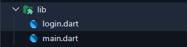

<div style="background-color: #215294; color: white; text-align: center; padding: 20px;">
  <h1>Login Page Walkthrough</h1>
</div>

---

## Table of Contents
- [Essentials](#essentials)
    - [Step 1: Setting Up the Initial Login Screen](#step-1-setting-up-the-initial-login-screen)
    - [Step 2: Creating the Page Structure](#step-2-creating-the-page-structure)
    - [Step 3: Adding the App Logo](#step-3-adding-the-app-logo)
    - [Step 4: Designing the Login Card](#step-4-designing-the-login-card)
    - [Step 5: Adding Welcome Text](#step-5-adding-welcome-text)
    - [Step 6: Creating Input Fields](#step-6-creating-input-fields)
    - [Step 7: Implementing the Login Button](#step-7-implementing-the-login-button)
    - [Step 8: Adding Login Logic](#step-8-adding-login-logic)
- [Enhancements](#enhancements)
    - [Step 9: Enhancing with a Background Image](#step-9-enhancing-with-a-background-image)
    - [Step 10: Optimizing the Login Card](#step-10-optimizing-the-login-card)
    - [Step 11: Adding "Remember Me" Feature](#step-11-adding-remember-me-feature)
    - [Step 12: Adding New Account Option](#step-12-adding-new-account-option)

---

# Essentials

## Step 1: Setting Up the Initial Login Screen

### Concept in Flutter:
Every Flutter app begins with the `main.dart` file, which acts as the entry point. The Flutter app hierarchy revolves around widgets—everything in Flutter is a widget. To structure your app, you use a `MaterialApp` widget, which provides access to material design elements like themes and navigation. To make the app functional, we define the `home` property of `MaterialApp` and point it to our initial screen. In this case, it’s a `LoginPage` widget, implemented as a `StatefulWidget` because its content (e.g., form inputs) will change dynamically.

### Tasks:
1. Create a new file called `login.dart` in your `lib` folder.
   
    |  | ➡️ |  |
    |--------------------------------|---|--------------------------------|

2. In the `login.dart` import the Material package.
    ```dart
    import 'package:flutter/material.dart';
    ```
3. Create the `LoginPage` widget as a `StatefulWidget`. Since our login page will have dynamic content like text input fields and button clicks that can change over time, we need to use `StatefulWidget`. This allows us to keep track of changes in the page's state (like what the user types).
    - Pro tip: Type `stf` in VS Code or Project IDX and press enter to quickly create a `StatefulWidget` template.
    - Just rename the widget to `LoginPage` and you're good to go!
    
    Your `LoginPage` should look like this now:

    ```dart
     // login.dart
     import 'package:flutter/material.dart';

     class LoginPage extends StatefulWidget {
          const LoginPage({super.key});

          @override
          State<LoginPage> createState() => _LoginPageState();
     }

     class _LoginPageState extends State<LoginPage> {
          @override
          Widget build(BuildContext context) {
                return const Placeholder();
          }
     }
    ```

4. In order to inform our app that `LoginPage` is our first page to be shown, we need to update `main.dart`, which is the entry point of every Flutter application (like `main()` in other programming languages). We'll use `MaterialApp`, which is a crucial Flutter widget that sets up the basic structure for a Material Design app - it provides common functionality like navigation, theming, and localization. By setting its `home` property to `LoginPage`, we're telling Flutter which screen to show first when the app launches. Think of `home` as the "default page" or "landing page" of your app.

   Here's what we'll change in `main.dart`:

    ```dart
    import 'package:flutter/material.dart';
    import 'package:flutter_workshop/login.dart';

    void main() {
        runApp(const MyApp());
    }

    class MyApp extends StatelessWidget {
        const MyApp({super.key});

        @override
        Widget build(BuildContext context) {
            return MaterialApp(
                debugShowCheckedModeBanner: false, // remove the debug banner
                home: LoginPage(),
            );
        }
    }
    ```

## Step 2: Creating the Page Structure


### Concept in Flutter:
The `Scaffold` widget serves as the backbone of most Flutter pages, providing a consistent layout structure. It contains properties like `body`, `appBar`, and `floatingActionButton`, which are used to organize content. For aligning elements, Flutter provides layout widgets like `Center`, which centers child widgets, and `Column`, which stacks child widgets vertically. Using these, we can create a foundation for our login page.

### Tasks:
1. Use a `Scaffold` widget to provide the base layout for the page.
2. Add a `Center` widget to align content in the middle of the screen.
3. Use a `Column` widget inside the `Center` to arrange the page elements vertically (e.g., logo, form).
- Use `mainAxisAlignment` to align the children of Column widget along the main axis (vertical) to be centered, and `crossAxisAlignment` to center align the children horizontally

   ```dart
    @override
    Widget build(BuildContext context) {
        return Scaffold(
            body: Center(
                child: Column(
                    mainAxisAlignment: MainAxisAlignment.center, 
                    crossAxisAlignment: CrossAxisAlignment.center,
                    children: [
                        // form widget to be put here
                    ],
                ),
            ),
        );
    }
    ```

4. Separate sections of the login page (e.g., logo, login form) into individual functions for better code organization. each function is placed after the build function and called within the column.
   
- Use `SizedBox` widget for spacing purpose.

    ```dart
    @override
    Widget build(BuildContext context) {
        return Scaffold(
            body: Center(
                child: Column(
                    mainAxisAlignment: MainAxisAlignment.center,
                    crossAxisAlignment: CrossAxisAlignment.center,
                    children: [
                        // Logo
                        logoImage(),
                        // Space
                        const SizedBox(height: 20),
                        // Login form Card
                        loginCard(),
                    ],
                ),
            ),
        );
    }

    Widget logoImage() {
        // To be filled in step 3
    }

    Widget loginCard() {
        // To be filled in step 4
    }
    ```

## Step 3: Adding the App Logo

<p>
  <strong>Logo:</strong>
  
</p>

### Concept in Flutter:
In Flutter, images are added using the `Image` widget. To use local images, you must first add them to the project’s assets folder and declare them in the `pubspec.yaml` file under the `flutter > assets` section. This ensures Flutter knows where to find the image. The `pubspec.yaml` file is a crucial configuration file in Flutter projects that defines various project dependencies, metadata, and assets. It's similar to `package.json` in Node.js or `pom.xml` in Maven projects. This file helps Flutter manage:

  - Project dependencies and versions
  - Project metadata (name, description, version)
  - Flutter-specific configurations
  - Asset declarations (images, fonts, etc.)

After adding assets to `pubspec.yaml`, simply save the file or run `flutter pub get` in the terminal to update the project configuration.

The `Image.asset` widget is then used to display these assets in your UI.

### Tasks:
1. Create an `assets` folder in your project’s root directory and place the logo image in the `assets` folder.


2. Update the `pubspec.yaml` file by specifying the image path under `flutter > assets`. If you look at your `pubspec.yaml` file, usually in line number 61-64, you'll find a commented section that shows where to add assets. By default, it looks like this:

    ```yaml
    # The following section is specific to Flutter packages.
    flutter:
        # The following line ensures that the Material Icons font is
        # included with your application, so that you can use the icons in
        # the material Icons class.
        uses-material-design: true

        # To add assets to your application, add an assets section, like this:
        # assets:
        #   - images/a_dot_burr.jpeg
        #   - images/a_dot_ham.jpeg

        # An image asset can refer to one or more resolution-specific "variants", see
        # https://flutter.dev/assets-and-images/#resolution-aware

        # For details regarding adding assets from package dependencies, see
        # https://flutter.dev/assets-and-images/#from-packages
    ```

    Remove the comment (#) and add your asset path under `assets:`. You can add multiple assets by adding more lines with a dash (-) prefix. The final result should look like this:

    ```yaml
    flutter:
      assets:
        - assets/logo.png
    ```

3. Back to your function in the `login.dart`, use the `Image.asset` widget to display the logo at the top of the login page, and use properties like `width` to customize the visualization.
   
    ```dart
    Widget logoImage() {
        return Image.asset('/logo.png', width: 50);
    }
    ```

## Step 4: Designing the Login Card


### Concept in Flutter:
The `Card` widget provides a material design card-like container with elevation and rounded corners. Inside the card, you can use a `Container` widget to manage padding, alignment, and sizing. Using a `Column` widget inside the card allows you to stack and organize the form elements (like text inputs and buttons).

### Tasks:
1. Add a `Card` widget to the page to contain the login form.
2. Use a `Container` widget with padding (`EdgeInsets`) to space the card’s content.
3. Use a `Column` widget inside the card to stack the form elements vertically.
4. Separate each section of the form (e.g., welcome text, input fields) into its own function for modularity. add them after `loginCard` function

    ```dart
    Widget loginCard() {
        return Card(
            color: Colors.white,
            elevation: 3, // shadow depth
            child: Container(
                padding: const EdgeInsets.all(20),
                child: Column(
                    mainAxisAlignment: MainAxisAlignment.center,
                    crossAxisAlignment: CrossAxisAlignment.center,
                    children: [
                        welcomeTexts(),
                        const SizedBox(height: 40),
                        textFields(),
                        const SizedBox(height: 40),
                        loginButton(),
                    ],
                ),
            ),
        );
    }

    Widget welcomeTexts() {
        // To be filled in step 5
    }

    Widget textFields() {
        // To be filled in step 6
    }

    Widget loginButton() {
        // To be filled in step 7
    }
    ```

## Step 5: Adding Welcome Text


### Concept in Flutter:
The `Text` widget is used to display text in Flutter. By using `Column`, you can stack multiple text widgets vertically. Styling is achieved using the `TextStyle` property, which allows you to define font size, weight, color, and more.

### Tasks:
1. Add a `Column` inside the login card for text elements.
2. Create two `Text` widgets:
     - A bold, larger font for the main welcome message (e.g., "Welcome Back").
     - A smaller, regular font for instructional text (e.g., "Sign in to access your account").
3. Use the `TextStyle` property to style the text, making it visually distinct and engaging.

    ```dart
    Widget welcomeTexts() {
        return Column(
            children: [
                Text(
                    'Welcome Back',
                    style: TextStyle(fontSize: 32, fontWeight: FontWeight.bold),
                ),
                const SizedBox(height: 5),
                Text(
                    'Sign in to access your account',
                    style: TextStyle(fontSize: 16, fontWeight: FontWeight.normal),
                ),
            ],
        );
    }
    ```

## Step 6: Creating Input Fields


### Concept in Flutter:
The `TextField` widget is used for user input. Visualization of it can be customized with the `InputDecoration` property to add labels, placeholders, and styling. For organizing multiple input fields, use a `Column` widget to stack them.

### Tasks:
1. Use a `Column` to organize two `TextField` widgets—one for the email and one for the password.
   - Apply `InputDecoration` to property `decoration` of `Textfield`, to add labels and a light background color for the input fields.
     - `labelText` is the label text for the input field, which will be displayed as a placeholder when the field is empty.
     - `filled` Indicates that the input field should be filled with `fillColor` background color.
  
   - Use `obscureText: true` for the password field to hide input characters.

    ```dart
    Widget textFields() {
        return Column(
            children: [
                // Email
                TextField(
                    decoration: InputDecoration(
                        labelText: "Email",
                        filled: true,
                        fillColor: Colors.grey[200],
                        ),
                ),
                const SizedBox(height: 15),
                // Password
                TextField(
                    decoration: InputDecoration(
                        labelText: "Password",
                        filled: true,
                        fillColor: Colors.grey[200],
                        ),
                    obscureText: true,
                ),
            ],
        );
    }
    ```

2. The width of the `TextField` widget is equal to the width of its parent widget. To fix its width on the screen, set the desired width for the parent `Container` in the `loginCard`. Your `loginCard` should look like this now:
    ```dart
    Widget loginCard() {
        return Card(
            color: Colors.white,
            elevation: 3,
            child: Container(
                width: 400, // <-- add this line to specify width of Container
                padding: const EdgeInsets.all(20),
                child: Column(
                    mainAxisAlignment: MainAxisAlignment.center,
                    crossAxisAlignment: CrossAxisAlignment.center,
                    children: [
                        welcomeTexts(),
                        const SizedBox(height: 40),
                        textFields(),
                        const SizedBox(height: 40),
                        loginButton(),
                    ],
                ),
            ),
        );
    }
    ```

## Step 7: Implementing the Login Button


### Concept in Flutter:
The `ElevatedButton` widget is used for clickable buttons. Customizing buttons involves using the `style` property, where you can define attributes like color and size. To make the button full-width, wrap it in a `Container` and set its width.

### Tasks:
1. Add an `ElevatedButton` widget for the login action.
2. Use the `style` property to customize the button’s appearance (e.g., background color, text style).
    - To use custom Color, we can use the format `0xff`+`hexcode`. hex code of the color must be without `#`.
3. Add a child, which is a `Text` that display the button title.
4. Wrap the button in a `Container`. Use `double.infinity` to set its width to  highest possible width, which is the `loginCard`.
5. `onPressed` is used for the button for functionality when it is clicked. we will fill this in step 8 with our logics.

```dart
Widget loginButton() {
    return Container(
        height: 40,
        width: double.infinity,
        child: ElevatedButton(
            style: ElevatedButton.styleFrom(
                backgroundColor: Color(0xff0553B1),
            ),
            onPressed: () {
                // to be filled with login logic here in step 8
            },
            child: Text('Login', style: TextStyle(color: Colors.white)),
        ),
    );
}
```

## Step 8: Adding Login Logic

### Concept in Flutter:
The `TextEditingController` is used to retrieve and manage text input from `TextField` widgets. You can add logic to validate user input, and provide feedback using the `SnackBar` widget. Navigation between pages is achieved using `Navigator.push`.

### Tasks:
1. Create `TextEditingController` instances for the email and password fields, before the build function, just after line `class _LoginPageState extends State<LoginPage> {`.
    ```dart
    // Controllers
    final TextEditingController emailController = TextEditingController();
    final TextEditingController passwordController = TextEditingController();
    ```
- A good practice is to dispose the controllers for memory management.
  
2. Attach the controllers to their respective `TextField` widgets.
    ```dart
    Widget textFields() {
        return Column(
            children: [
                //Email
                TextField(
                    controller: emailController, // <-- adding the controller
                    decoration: InputDecoration(
                        labelText: "Email",
                        filled: true,
                        fillColor: Colors.grey[200],
                    ),
                ),
                const SizedBox(height: 15),
                //Password
                TextField(
                    controller: passwordController, // <-- adding the controller
                    decoration: InputDecoration(
                        labelText: "Password",
                        filled: true,
                        fillColor: Colors.grey[200],
                    ),
                    obscureText: true,
                ),
            ],
        );
    }
    ```
3. To go new page after succesfull login, create a new file `dashboard.dart` in the `lib` folder and create a `StatefulWidget` named `DashboardScreen` just like creating login page.
    
    |  | ➡️ |  |
    |--------------------------------|---|--------------------------------|

    ```dart
    import 'package:flutter/material.dart';

    class DashboardPage extends StatefulWidget {
        const DashboardPage({super.key});

        @override
        State<DashboardPage> createState() => _DashboardPageState();
    }

    class _DashboardPageState extends State<DashboardPage> {
        @override
        Widget build(BuildContext context) {
            return const Placeholder();
        }
    }
    ```
4. Implement validation logic to check user input.
   - Dart language is similar to C++/Java for conditional statements. Use simple `if else` to achieve comparison
   - Use a `SnackBar` to display feedback (e.g., "Login Successful" or "Login Failed").
   - Navigate to a new Dashboard page upon successful login.

    ```dart
    void loginLogic() {

        if (emailController.text == 'admin' && passwordController.text == 'root') {
            // Succesfful Feedback
            ScaffoldMessenger.of(context).showSnackBar(
                SnackBar(
                    content: Text('Login Successful!'),
                    backgroundColor: Colors.green,
                ),
            );
            // Navigate to the Dashboard Page
            Navigator.push(
            context,
            MaterialPageRoute(builder: (context) => const DashboardPage()),
            );

        } else {
            // Failed Feedback
            ScaffoldMessenger.of(context).showSnackBar(
                SnackBar(
                    content: Text('Login Failed!'),
                    backgroundColor: Colors.red,
                ),
            );
        }
    }
    ```
---

# Enhancements

## Step 9: Enhancing with a Background Image


### Concept in Flutter:
A background image can be added using the `Container` widget with `BoxDecoration`. The `decoration` property allows you to define a background image and control its positioning and scaling using the `fit` property.

### Tasks:
1. Add a background image to the `assets` folder and update `pubspec.yaml`.
2. Replace the `Center` widget with a `Container` to wrap the entire screen.
3. Use `MediaQuery` to get the width and height of the screen. This ensures the background image covers the entire screen regardless of the device size.
4. Use `BoxDecoration` to set the background image, ensuring it covers the full screen.

    ```dart    
    @override
    Widget build(BuildContext context) {
        return Scaffold(
            body: Container(
                // Screen size width & height
                width: MediaQuery.of(context).size.width,
                height: MediaQuery.of(context).size.height,
                decoration: BoxDecoration(
                    // background of Container
                    image: DecorationImage(
                        image: AssetImage('/login_bg.png'),
                        fit: BoxFit.cover,
                    ),
                ),
                child: Column(
                    mainAxisAlignment: MainAxisAlignment.center,
                    crossAxisAlignment: CrossAxisAlignment.center,
                    children: [
                        logoImage(),
                        const SizedBox(height: 20),
                        loginCard(),
                    ],
                ),
            ),
        );
    }
    ```

## Step 10: Optimizing the Login Card

### Concept in Flutter:
To make the login card responsive, use `MediaQuery` to dynamically adjust the width based on the screen size. This ensures the card looks good on both small and large screens.

### Tasks:
1. Use `MediaQuery` to calculate the appropriate width for the login card.
2. Set the width of the card to a percentage of the screen width (e.g., 80% on smaller screens, 40% on larger screens).
3. Test the layout on different screen sizes to ensure responsiveness.
- The if condition is structured using a ternary operator `(condition ? True : False)`

    ```dart
    Widget loginCard() {
        return Card(
            elevation: 3,
            child: Container(
                // Condition based container width based on the width of screen
                width: (MediaQuery.of(context).size.width < 800)
                        ? MediaQuery.of(context).size.width * 0.8
                        : MediaQuery.of(context).size.width * 0.4,
                padding: const EdgeInsets.all(20),
                child: Column(
                    crossAxisAlignment: CrossAxisAlignment.center,
                    mainAxisAlignment: MainAxisAlignment.center,
                    children: [
                        welcomeTexts(),
                        const SizedBox(height: 40),
                        textFields(),
                        const SizedBox(height: 20),
                        rememberMeRow(),
                        const SizedBox(height: 40),
                        loginButton(),
                        const SizedBox(height: 20),
                        newAccButton(),
                    ],
                ),
            ),
        );
    }
    ```

## Step 11: Adding "Remember Me" Feature


### Concept in Flutter:
The `CheckboxListTile` widget combines a checkbox and a label, making it ideal for features like "Remember Me." State management is required to toggle the checkbox value dynamically.

### Tasks:
1. Define a `bool` state variable to manage the checkbox value, right after the controllers.
   ```dart
   // Controllers
   final TextEditingController emailController = TextEditingController();
   final TextEditingController passwordController = TextEditingController();

   // Remember Me value
   bool isRememberMe = false;
   ```
2. Add a `Row` widget to the login card for the "Remember Me" option.
   - The `setState` method is used to notify Flutter that the state of the widget has changed, prompting it to rebuild the UI. it updates the checkbox value dynamically when the user toggles it, ensuring the new value is reflected in the UI immediately.
3. Use a `CheckboxListTile` to create the checkbox and label.
4. Add a placeholder "Forgot Password" button for future functionality.
    ```dart
    Widget rememberMeRow() {
        return Row(
            mainAxisAlignment: MainAxisAlignment.spaceBetween,
            children: [
                Row(
                    children: [
                        Checkbox(
                                value: isRememberMe,
                                onChanged: (bool? value) {
                                    setState(() {
                                        isRememberMe = value!;
                                    });
                                }),
                        Text('Remember Me'),
                    ],
                ),
                TextButton(
                    onPressed: () {
                        ScaffoldMessenger.of(context).showSnackBar(
                            SnackBar(
                                content: Text('Forgot Password Button Pressed!'),
                                backgroundColor: Colors.blue,
                            ),
                        );
                    },
                    child: Text('Forgot Password?'),
                ),
            ],
        );
    }
    ```
5. Add your function to `Column` widget of `loginCard`.
    ```dart
    Widget loginCard() {
        return Card(
        color: Colors.white,
        elevation: 3,
        child: Container(
            width: (MediaQuery.of(context).size.width < 800)
                ? MediaQuery.of(context).size.width * 0.8
                : MediaQuery.of(context).size.width * 0.4,
            padding: const EdgeInsets.all(20),
            child: Column(
            mainAxisAlignment: MainAxisAlignment.center,
            crossAxisAlignment: CrossAxisAlignment.center,
            children: [
                welcomeTexts(),
                const SizedBox(height: 40),
                textFields(),
                const SizedBox(height: 20),
                rememberMeRow(),
                const SizedBox(height: 40),
                loginButton(),
            ],
            ),
        ),
        );
    }
    ```

## Step 12: Adding New Account Option


### Concept in Flutter:
The `TextButton` widget provides a lightweight tappable button for secondary actions. You can customize its text and define its behavior on press.

### Tasks:
1. Add a `TextButton` to the bottom of the login card for the "Create New Account" option.
2. Style the button text to match your app’s theme.
3. Prepare the button for potential future navigation or functionality.

    ```dart
    // login.dart
    Widget newAccButton() {
        return TextButton(
            onPressed: () {
                ScaffoldMessenger.of(context).showSnackBar(
                    SnackBar(
                        content: Text('New Account Button Pressed!'),
                        backgroundColor: Colors.blue,
                    ),
                );
            },
            child: Text('Create New Account'),
        );
    }
    ```
4. Add your function to `Column` widget of `loginCard`.
    ```dart
    Widget loginCard() {
        return Card(
        color: Colors.white,
        elevation: 3,
        child: Container(
            width: (MediaQuery.of(context).size.width < 800)
                ? MediaQuery.of(context).size.width * 0.8
                : MediaQuery.of(context).size.width * 0.4,
            padding: const EdgeInsets.all(20),
            child: Column(
            mainAxisAlignment: MainAxisAlignment.center,
            crossAxisAlignment: CrossAxisAlignment.center,
            children: [
                welcomeTexts(),
                const SizedBox(height: 40),
                textFields(),
                const SizedBox(height: 20),
                rememberMeRow(),
                const SizedBox(height: 40),
                loginButton(),
                const SizedBox(height: 20),
                newAccButton(),
            ],
            ),
        ),
        );
    }
    ```
