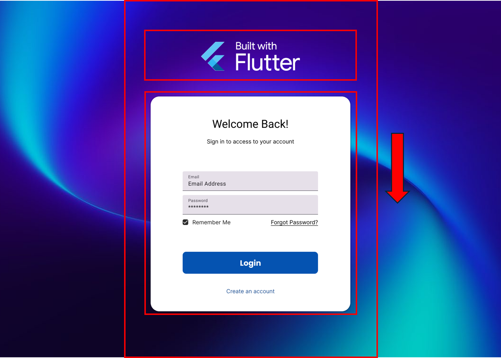
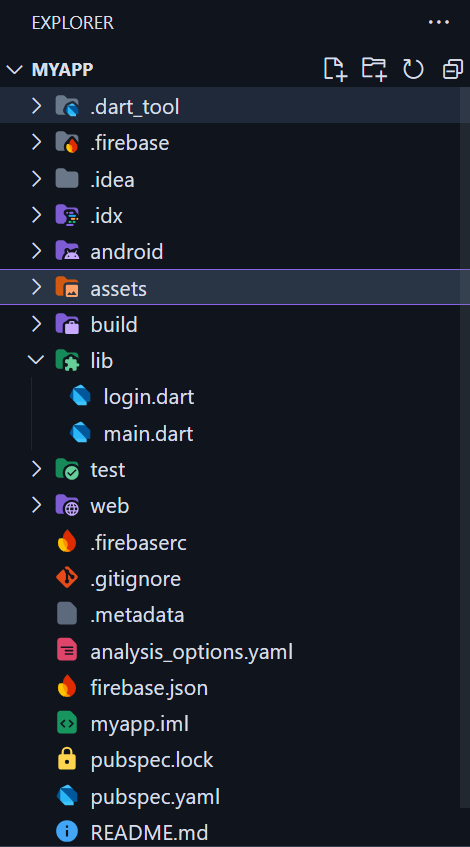

<div style="background-color: #215294; color: white; text-align: center; padding: 20px;">
  <h1>Login Page Walkthrough</h1>
</div>

---

## Table of Contents
- [Essentials](#essentials)
    - [Step 1: Setting Up the Initial Login Screen](#step-1-setting-up-the-initial-login-screen)
    - [Step 2: Creating the Page Structure](#step-2-creating-the-page-structure)
    - [Step 3: Adding the App Logo](#step-3-adding-the-app-logo)
      
---

# Essentials

## Step 1: Setting Up the Initial Login Screen

### Concept in Flutter:
Every Flutter app begins with the `main.dart` file, which acts as the entry point. The Flutter app hierarchy revolves around widgets—everything in Flutter is a widget. To structure your app, you use a `MaterialApp` widget, which provides access to material design elements like themes and navigation. To make the app functional, we define the `home` property of `MaterialApp` and point it to our initial screen. In this case, it’s a `LoginPage` widget, implemented as a `StatefulWidget` because its content (e.g., form inputs) will change dynamically.

### Tasks:
1. Create a new file called `login.dart` in your `lib` folder.
   
    |  | ➡️ |  |
    |--------------------------------|---|--------------------------------|

2. In the `login.dart` import the Material package.
    ```dart
    import 'package:flutter/material.dart';
    ```
3. Create the `LoginPage` widget as a `StatefulWidget`. Since our login page will have dynamic content like text input fields and button clicks that can change over time, we need to use `StatefulWidget`. This allows us to keep track of changes in the page's state (like what the user types).
    - Pro tip: Type `stf` in VS Code or Project IDX and press enter to quickly create a `StatefulWidget` template.
    - Just rename the widget to `LoginPage` and you're good to go!
    
    Your `LoginPage` should look like this now:

    ```dart
     // login.dart
     import 'package:flutter/material.dart';

     class LoginPage extends StatefulWidget {
          const LoginPage({super.key});

          @override
          State<LoginPage> createState() => _LoginPageState();
     }

     class _LoginPageState extends State<LoginPage> {
          @override
          Widget build(BuildContext context) {
                return const Placeholder();
          }
     }
    ```

4. In order to inform our app that `LoginPage` is our first page to be shown, we need to update `main.dart`, which is the entry point of every Flutter application (like `main()` in other programming languages). We'll use `MaterialApp`, which is a crucial Flutter widget that sets up the basic structure for a Material Design app - it provides common functionality like navigation, theming, and localization. By setting its `home` property to `LoginPage`, we're telling Flutter which screen to show first when the app launches. Think of `home` as the "default page" or "landing page" of your app.

   Here's what we'll change in `main.dart`:

    ```dart
    import 'package:flutter/material.dart';
    import 'package:flutter_workshop/login.dart';

    void main() {
        runApp(const MyApp());
    }

    class MyApp extends StatelessWidget {
        const MyApp({super.key});

        @override
        Widget build(BuildContext context) {
            return MaterialApp(
                debugShowCheckedModeBanner: false, // remove the debug banner
                home: LoginPage(),
            );
        }
    }
    ```

## Step 2: Creating the Page Structure



### Concept in Flutter:
The `Scaffold` widget serves as the backbone of most Flutter pages, providing a consistent layout structure. It contains properties like `body`, `appBar`, and `floatingActionButton`, which are used to organize content. For aligning elements, Flutter provides layout widgets like `Center`, which centers child widgets, and `Column`, which stacks child widgets vertically. Using these, we can create a foundation for our login page.

### Tasks:
1. Use a `Scaffold` widget to provide the base layout for the page.
2. Add a `Center` widget to align content in the middle of the screen.
3. Use a `Column` widget inside the `Center` to arrange the page elements vertically (e.g., logo, form).
- Use `mainAxisAlignment` to align the children of Column widget along the main axis (vertical) to be centered, and `crossAxisAlignment` to center align the children horizontally

   ```dart
    @override
    Widget build(BuildContext context) {
        return Scaffold(
            body: Center(
                child: Column(
                    mainAxisAlignment: MainAxisAlignment.center, 
                    crossAxisAlignment: CrossAxisAlignment.center,
                    children: [
                        // form widget to be put here
                    ],
                ),
            ),
        );
    }
    ```

4. Separate sections of the login page (e.g., logo, login form) into individual functions for better code organization. each function is placed after the build function and called within the column.
   
- Use `SizedBox` widget for spacing purpose.

    ```dart
    @override
    Widget build(BuildContext context) {
        return Scaffold(
            body: Center(
                child: Column(
                    mainAxisAlignment: MainAxisAlignment.center,
                    crossAxisAlignment: CrossAxisAlignment.center,
                    children: [
                        // Logo
                        logoImage(),
                        // Space
                        const SizedBox(height: 20),
                        // Login form Card
                        loginCard(),
                    ],
                ),
            ),
        );
    }

    Widget logoImage() {
        // To be filled in step 3
    }

    Widget loginCard() {
        // To be filled in step 4
    }
    ```

## Step 3: Adding the App Logo

<p>
  <strong>Logo:</strong>
  
</p>

### Concept in Flutter:
In Flutter, images are added using the `Image` widget. To use local images, you must first add them to the project’s assets folder and declare them in the `pubspec.yaml` file under the `flutter > assets` section. This ensures Flutter knows where to find the image. The `pubspec.yaml` file is a crucial configuration file in Flutter projects that defines various project dependencies, metadata, and assets. It's similar to `package.json` in Node.js or `pom.xml` in Maven projects. This file helps Flutter manage:

  - Project dependencies and versions
  - Project metadata (name, description, version)
  - Flutter-specific configurations
  - Asset declarations (images, fonts, etc.)

After adding assets to `pubspec.yaml`, simply save the file or run `flutter pub get` in the terminal to update the project configuration.

The `Image.asset` widget is then used to display these assets in your UI.

### Tasks:
1. Create an `assets` folder in your project’s root directory and place the logo image in the `assets` folder.



2. Update the `pubspec.yaml` file by specifying the image path under `flutter > assets`. If you look at your `pubspec.yaml` file, usually in line number 61-64, you'll find a commented section that shows where to add assets. By default, it looks like this:

    ```yaml
    # The following section is specific to Flutter packages.
    flutter:
        # The following line ensures that the Material Icons font is
        # included with your application, so that you can use the icons in
        # the material Icons class.
        uses-material-design: true

        # To add assets to your application, add an assets section, like this:
        # assets:
        #   - images/a_dot_burr.jpeg
        #   - images/a_dot_ham.jpeg

        # An image asset can refer to one or more resolution-specific "variants", see
        # https://flutter.dev/assets-and-images/#resolution-aware

        # For details regarding adding assets from package dependencies, see
        # https://flutter.dev/assets-and-images/#from-packages
    ```

    Remove the comment (#) and add your asset path under `assets:`. You can add multiple assets by adding more lines with a dash (-) prefix. The final result should look like this:

    ```yaml
    flutter:
      assets:
        - assets/logo.png
    ```

3. Back to your function in the `login.dart`, use the `Image.asset` widget to display the logo at the top of the login page, and use properties like `width` to customize the visualization.
   
    ```dart
    Widget logoImage() {
        return Image.asset('/logo.png', width: 50);
    }
    ```
