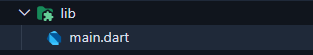
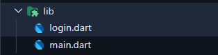

<div style="background-color: #215294; color: white; text-align: center; padding: 20px;">
  <h1>Login Page Walkthrough</h1>
</div>

---

## Table of Contents
- [Essentials](#essentials)
    - [Step 1: Setting Up the Initial Login Screen](#step-1-setting-up-the-initial-login-screen)

---

# Essentials

## Step 1: Setting Up the Initial Login Screen

### Concept in Flutter:
Every Flutter app begins with the `main.dart` file, which acts as the entry point. The Flutter app hierarchy revolves around widgets—everything in Flutter is a widget. To structure your app, you use a `MaterialApp` widget, which provides access to material design elements like themes and navigation. To make the app functional, we define the `home` property of `MaterialApp` and point it to our initial screen. In this case, it’s a `LoginPage` widget, implemented as a `StatefulWidget` because its content (e.g., form inputs) will change dynamically.

### Tasks:
1. Create a new file called `login.dart` in your `lib` folder.
   
    |  | ➡️ |  |
    |--------------------------------|---|--------------------------------|

2. In the `login.dart` import the Material package.
    ```dart
    import 'package:flutter/material.dart';
    ```
3. Create the `LoginPage` widget as a `StatefulWidget`. Since our login page will have dynamic content like text input fields and button clicks that can change over time, we need to use `StatefulWidget`. This allows us to keep track of changes in the page's state (like what the user types).
    - Pro tip: Type `stf` in VS Code or Project IDX and press enter to quickly create a `StatefulWidget` template.
    - Just rename the widget to `LoginPage` and you're good to go!
    
    Your `LoginPage` should look like this now:

    ```dart
     // login.dart
     import 'package:flutter/material.dart';

     class LoginPage extends StatefulWidget {
          const LoginPage({super.key});

          @override
          State<LoginPage> createState() => _LoginPageState();
     }

     class _LoginPageState extends State<LoginPage> {
          @override
          Widget build(BuildContext context) {
                return const Placeholder();
          }
     }
    ```

4. In order to inform our app that `LoginPage` is our first page to be shown, we need to update `main.dart`, which is the entry point of every Flutter application (like `main()` in other programming languages). We'll use `MaterialApp`, which is a crucial Flutter widget that sets up the basic structure for a Material Design app - it provides common functionality like navigation, theming, and localization. By setting its `home` property to `LoginPage`, we're telling Flutter which screen to show first when the app launches. Think of `home` as the "default page" or "landing page" of your app.

   Here's what we'll change in `main.dart`:

    ```dart
    import 'package:flutter/material.dart';
    import 'package:flutter_workshop/login.dart';

    void main() {
        runApp(const MyApp());
    }

    class MyApp extends StatelessWidget {
        const MyApp({super.key});

        @override
        Widget build(BuildContext context) {
            return MaterialApp(
                debugShowCheckedModeBanner: false, // remove the debug banner
                home: LoginPage(),
            );
        }
    }
    ```
