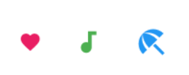

<div style="background-color: #215294; color: white; text-align: center; padding: 20px;">
  <h1>Workshop UI Reference Guide</h1>
</div>

--- 

Welcome to our Flutter UI workshop reference guide! This document compiles the essential Flutter widgets and components we'll be working with throughout the workshop. Each section provides detailed explanations, key parameters, and practical code examples to help you build beautiful and functional Flutter applications.

---
## Table of Content

### 1. Core
<table>
<tr>
<td width="30%"><a href="#statelesswidget">StatelessWidget</a></td>
<td width="30%"><a href="#statefulwidget">StatefulWidget</a></td>
<td width="30%"><a href="#materialapp">MaterialApp</a></td>
</tr>
</table>

### 2. Layout
<table>
<tr>
<td width="25%">
<a href="#scaffold">
<br>
Scaffold
</a>
</td>
<td width="25%">
<a href="#column">
<br>
Column
</a>
</td>
<td width="25%">
<a href="#row">
<br>
Row
</a>
</td>
<td width="25%">
<a href="#stack">
<br>
Stack
</a>
</td>
</tr>
<tr>
<td width="25%">
<a href="#wrap">
<!-- <br> -->
Wrap
</a>
</td>
<td width="25%">
<a href="#expanded">
<!-- <br> -->
Expanded
</a>
</td>
<td width="25%">
<a href="#singlechildscrollview">
<!-- <br> -->
Single Child Scroll View
</a>
</td>
<td width="25%">
</td>
</table>

### 3. Basic UI
<table>
<tr>
<td width="25%">
<a href="#container">
<br>
Container
</a>
</td>
<td width="25%">
<a href="#card">
<br>
Card
</a>
</td>
<td width="25%">
<a href="#text">
<br>
Text
</a>
</td>
<td width="25%">
<a href="#icon">
<br>
Icon
</a>
</td>
</tr>
<tr>
<td width="25%">
<a href="#sizedbox">
<br>
SizedBox
</a>
</td>
<td width="25%">
<a href="#image">
<br>
Image
</a>
</td>
<td width="25%">
<a href="#buttons">
<br>
Buttons
</a>
</td>
<td width="25%">
<a href="#textfield">
<br>
TextField
</a>
</td>
</tr>
<tr>
<td width="25%">
<a href="#padding">
<br>
Padding
</a>
</td>
<td width="25%">
<a href="#divider">
<br>
Divider
</a>
</td>
<td width="25%"></td>
<td width="25%"></td>
</tr>
</table>

### 4. Advanced UI
<table>
<tr>
<td width="25%">
<a href="#listview">
<br>
ListView
</a>
</td>
<td width="25%">
<a href="#streambuilder">StreamBuilder</a>
</td>
<td width="25%">
<a href="#futurebuilder">FutureBuilder</a>
</td>
<td width="25%">
<a href="#checkboxlisttile">
<br>
CheckboxListTile
</a>
</td>
</tr>
<tr>
<td width="25%">
<a href="#circularprogressindicator">
<br>
CircularProgressIndicator
</a>
</td>
<td width="25%">
<a href="#snackbar">
<br>
SnackBar
</a>
</td>
<td width="25%">
<a href="#chip">
<br>
Chip
</td>
<td width="25%"></td>
</tr>
</table>

### 5. Navigation
<table>
<tr>
<td width="50%">
<a href="#appbar">
<br>
AppBar
</a>
</td>
<td width="50%">
<a href="#drawer">
<br>
Drawer
</a>
</td>
</tr>
</table>

### 6. Colors
<table>
<tr>
<td width="50%">
<a href="#color">
<br>
Colors
</a>
</td>
</tr>
</table>

---


## 1. Core

### StatelessWidget
- **Introduction**: A widget that doesn’t change over time.
- **Sample Code**:
  ```dart
  class WelcomeScreen extends StatelessWidget {
    final String message;
    
    const WelcomeScreen({Key? key, required this.message}) : super(key: key);
    
    @override
    Widget build(BuildContext context) {
      return Container(
        child: Text(message),
      );
    }
  }
  ```

### StatefulWidget
- **Introduction**: A widget that has mutable state and can change dynamically.
- **Key Parameters**:
  - `State` class with `setState()` method for updating the UI
- **Sample Code**:
  ```dart
  class Counter extends StatefulWidget {
    const Counter({Key? key}) : super(key: key);

    @override
    _CounterState createState() => _CounterState();
  }

  class _CounterState extends State<Counter> {
    int _count = 0;

    void _increment() {
      // change the state to see the effect of count increase
      setState(() {
        _count++;
      });
    }

    @override
    Widget build(BuildContext context) {
      return Column(
        children: [
          Text('Count: $_count'),
          ElevatedButton(
            onPressed: _increment,
            child: Text('Increment'),
          ),
        ],
      );
    }
  }
  ```
---

### MaterialApp


- **Introduction**: Think of MaterialApp as the foundation of your Flutter app - it's like the main blueprint that sets up the basic structure and rules. Just as a house needs a foundation before you can build rooms, your Flutter app needs a MaterialApp before adding screens and widgets. It provides essential features like navigation, theming, and localization.

- **Key Parameters**:
  - `home`: The first screen users see (like your app's front door)
  - `title`: App name shown in device task managers
  - `theme`: App-wide visual settings including:
    - Color schemes
    - Text styles
    - Widget themes
  - `routes`: Map of named navigation paths (like a directory of your app's screens)
  - `debugShowCheckedModeBanner`: Shows/hides the debug banner
  - `locale`: App's language and region settings
  - `darkTheme`: Theme used in dark mode
  - `themeMode`: Controls when to use light/dark themes:
    - `ThemeMode.system`: Follow device settings
    - `ThemeMode.light`: Always use light theme
    - `ThemeMode.dark`: Always use dark theme

- **Sample Code**:
```dart
MaterialApp(
  title: 'My First App',
  debugShowCheckedModeBanner: false,
  theme: ThemeData(
    primarySwatch: Colors.blue,
    brightness: Brightness.light,
    useMaterial3: true,
  ),
  darkTheme: ThemeData(
    brightness: Brightness.dark,
    useMaterial3: true,
  ),
  home: MyHomePage(),
  routes: {
    '/settings': (context) => SettingsPage(),
    '/profile': (context) => ProfilePage(),
  },
)
```

---

## 2. Layout

### Scaffold


- **Introduction**: Implements the basic material design visual layout structure. Provides a framework for implementing the basic material design layout of an application.
- **Key Parameters**:
  - `backgroundColor`: The background of the layout/Page
  - `appBar`: The top AppBar of the screen
  - `body`: The primary content of the scaffold
  - `floatingActionButton`: A floating button anchored to the bottom-right
  - `drawer`: The side menu panel
- **Sample Code**:
  ```dart
  Scaffold(
      background: Colors.blue,
      drawer: drawer(),
      appBar: AppBar(
          title: Text('My App'),
      ),
      body: Center(
          child: Text('Hello World'),
      ),
      floatingActionButton: FloatingActionButton(
          onPressed: () {},
          child: Icon(Icons.add),
      ),
  )
  ```
---

### Column


- **Introduction**: A widget that displays its children in a vertical array. Takes up all available vertical space by default.
- **Key Parameters**:
- **Key Parameters**:
    - `mainAxisAlignment`: Vertical alignment of children
        - `MainAxisAlignment.start`: Place children at start
        - `MainAxisAlignment.end`: Place children at end
        - `MainAxisAlignment.center`: Place children at center
        - `MainAxisAlignment.spaceBetween`: Evenly space children with first/last at edges
        - `MainAxisAlignment.spaceAround`: Evenly space children with half-size edge spacing
        - `MainAxisAlignment.spaceEvenly`: Evenly space children including edges
    - `crossAxisAlignment`: Horizontal alignment of children
        - `CrossAxisAlignment.start`: Align children at start of cross axis
        - `CrossAxisAlignment.end`: Align children at end of cross axis
        - `CrossAxisAlignment.center`: Center children along cross axis
        - `CrossAxisAlignment.stretch`: Stretch children across cross axis
        - `CrossAxisAlignment.baseline`: Align children by their baselines
    - `children`: List of widgets to display vertically
    - `mainAxisSize`: How much space to occupy in the main axis
        - `MainAxisSize.max`: Take all available space
        - `MainAxisSize.min`: Take only necessary space
- **Sample Code**:
  ```dart
  Column(
    mainAxisAlignment: MainAxisAlignment.center,
    crossAxisAlignment: CrossAxisAlignment.start,
    children: [
      Text('Item 1'),
      Text('Item 2'),
      Text('Item 3'),
    ],
  )
  ```
---

### Row


- **Introduction**: A widget that displays its children in a horizontal array. Takes up all available horizontal space by default.
- **Key Parameters**:
    - `mainAxisAlignment`: Horizontal alignment of children
        - `MainAxisAlignment.start`: Place children at start
        - `MainAxisAlignment.end`: Place children at end
        - `MainAxisAlignment.center`: Place children at center
        - `MainAxisAlignment.spaceBetween`: Evenly space children with first/last at edges
        - `MainAxisAlignment.spaceAround`: Evenly space children with half-size edge spacing
        - `MainAxisAlignment.spaceEvenly`: Evenly space children including edges
    - `crossAxisAlignment`: Vertical alignment of children
        - `CrossAxisAlignment.start`: Align children at start of cross axis
        - `CrossAxisAlignment.end`: Align children at end of cross axis
        - `CrossAxisAlignment.center`: Center children along cross axis
        - `CrossAxisAlignment.stretch`: Stretch children across cross axis
        - `CrossAxisAlignment.baseline`: Align children by their baselines
    - `children`: List of widgets to display horizontally
    - `mainAxisSize`: How much space to occupy in the main axis
        - `MainAxisSize.max`: Take all available space
        - `MainAxisSize.min`: Take only necessary space
- **Key Parameters**:
  - `spacing`: Gap between adjacent children in a run
  - `runSpacing`: Gap between runs
  - `direction`: Main axis direction (horizontal or vertical)
- **Sample Code**:
  ```dart
  Wrap(
    spacing: 8.0,
    runSpacing: 4.0,
    children: [
      Chip(label: Text('Tag 1')),
      Chip(label: Text('Tag 2')),
      Chip(label: Text('Tag 3')),
    ],
  )
  ```
---

### Stack


- **Introduction**: A widget that positions its children relative to the edges of its box. Children can overlap and be positioned precisely using Positioned widget.
- **Key Parameters**:
  - `alignment`: How to align all non-positioned children
    - `AlignmentDirectional.topStart`: Top-left corner
    - `AlignmentDirectional.center`: Center of stack
    - `AlignmentDirectional.bottomEnd`: Bottom-right corner
  - `fit`: How to size the non-positioned children
    - `StackFit.loose`: Child can be smaller than Stack
    - `StackFit.expand`: Child must fill Stack
    - `StackFit.passthrough`: Child keeps its own size constraints
  - `clipBehavior`: Whether to clip children
    - `Clip.none`: No clipping
    - `Clip.hardEdge`: Clip without smoothing
    - `Clip.antiAlias`: Clip with smoothing
  - `children`: List of widgets to stack
- **Sample Code**:
  ```dart
  Stack(
    alignment: Alignment.center,
    children: [
    Container(
      width: 200,
      height: 200,
      color: Colors.red,
    ),
    Positioned(
      top: 10,
      right: 10,
      child: Container(
      width: 100,
      height: 100,
      color: Colors.blue,
      ),
    ),
    Text('Overlaid Text'),
    ],
  )
  ```
---

### Wrap


- **Introduction**: A widget that displays its children in multiple horizontal or vertical runs. Automatically wraps onto multiple lines when running out of space.
- **Key Parameters**:
  - `direction`: Direction of the layout
    - `Axis.horizontal`: Arrange items horizontally
    - `Axis.vertical`: Arrange items vertically
  - `alignment`: How the children are aligned within their run
    - `WrapAlignment.start`: Place children at start
    - `WrapAlignment.end`: Place children at end
    - `WrapAlignment.center`: Place children at center
    - `WrapAlignment.spaceBetween`: Space evenly, first/last at edges
    - `WrapAlignment.spaceAround`: Space evenly with smaller edge spacing
    - `WrapAlignment.spaceEvenly`: Space evenly including edges
  - `spacing`: Gap between adjacent children in a run
  - `runSpacing`: Gap between runs
  - `runAlignment`: How the runs align with each other
  - `crossAxisAlignment`: How children within a run align with each other
- **Sample Code**:
  ```dart
  Wrap(
    spacing: 8.0,
    runSpacing: 4.0,
    alignment: WrapAlignment.center,
    children: List.generate(
    8,
    (index) => Chip(
      label: Text('Item $index'),
      backgroundColor: Colors.blue[100],
    ),
    ),
  )
  ```
---


### Expanded


- **Introduction**: A widget that expands a child of a Row, Column, or Flex to fill available space. Think of it as a stretchable container that grows to fill empty space.
- **Key Parameters**:
  - `flex`: How much space to take relative to other Expanded widgets
  - `child`: The widget to expand
- **Sample Code**:
  ```dart
  Row(
    children: [
      Expanded(
        flex: 2,  // Takes up 2/3 of the space
        child: Container(
          color: Colors.blue,
          child: Text('Larger'),
        ),
      ),
      Expanded(
        flex: 1,  // Takes up 1/3 of the space
        child: Container(
          color: Colors.red,
          child: Text('Smaller'),
        ),
      ),
    ],
  )
  ```

---

### SingleChildScrollView

- **Introduction**: Think of SingleChildScrollView as a magic container that makes its content scrollable. It's like having a window into a larger space - when your content is too big to fit on the screen, SingleChildScrollView lets you scroll to see everything. It's perfect for forms, long text, or any content that might overflow the screen.

- **Key Parameters**:
  - `scrollDirection`: Which way to scroll
    - `Axis.vertical`: Scroll up and down (default)
    - `Axis.horizontal`: Scroll left and right
  - `reverse`: Whether to reverse the scroll direction
    - `false`: Normal scrolling (default)
    - `true`: Reverse scrolling (bottom to top or right to left)
  - `padding`: Space around the scrollable content
  - `physics`: How the scrolling behaves
    - `ClampingScrollPhysics`: Android-style bouncing
    - `BouncingScrollPhysics`: iOS-style bouncing
    - `NeverScrollableScrollPhysics`: Disables scrolling
  - `child`: The widget to make scrollable

- **Sample Code**:
```dart
SingleChildScrollView(
  padding: EdgeInsets.all(16.0),
  physics: BouncingScrollPhysics(),
  child: Column(
    children: [
      Text('Start of long content'),
      SizedBox(height: 20),
      Container(
        height: 200,
        color: Colors.blue,
        child: Center(child: Text('Box 1')),
      ),
      SizedBox(height: 20),
      Container(
        height: 200,
        color: Colors.green,
        child: Center(child: Text('Box 2')),
      ),
      SizedBox(height: 20),
      Container(
        height: 200,
        color: Colors.orange,
        child: Center(child: Text('Box 3')),
      ),
      Text('End of long content'),
    ],
  ),
)
```

---

## 3. Basic UI

### Container

|  |   |
|--------------------------------|--------------------------------|

- **Introduction**: A convenience widget that combines common painting, positioning, and sizing widgets.
- **Key Parameters**:
  - `decoration`: BoxDecoration for styling:
      - `boxShadow`: List of box shadows
      - `border`: Border around all sides
      - `borderRadius`: Corner rounding
      - `image`: Background image styling
      - `gradient`: Color gradient settings
      - `shape`: Box shape (rectangle/circle)
      - `color`: Background color
      - `backgroundBlendMode`: How background colors blend
  - `padding`/`margin`: Spacing controls
  - `width`/`height`: Size constraints
- **Sample Code**:
  ```dart
  Container(
    width: 200,
    height: 200,
    margin: EdgeInsets.all(10),
    decoration: BoxDecoration(
      color: Colors.white,
      borderRadius: BorderRadius.circular(10),
      border: Border.all(color: Colors.grey),
      image: DecorationImage(
        image: NetworkImage('url_to_image'),
        fit: BoxFit.cover,
      ),
      gradient: LinearGradient(
        colors: [Colors.blue, Colors.green],
        begin: Alignment.topLeft,
        end: Alignment.bottomRight,
      ),
    ),
    child: Center(child: Text('Hello')),
  )
  ```
---

### Card


- **Introduction**: A material design card with rounded corners and elevation shadow.
- **Key Parameters**:
  - `elevation`: Shadow depth
  - `shape`: Card's shape
  - `color`: Color of card
  - `child`: Widget to display inside the card
- **Sample Code**:
  ```dart
  Card(
    elevation: 4.0,
    color: Colors.white,
    shape: RoundedRectangleBorder(
      borderRadius: BorderRadius.circular(10.0),
    ),
    child: Padding(
      padding: EdgeInsets.all(16.0),
      child: Text('Card Content'),
    ),
  )
  ```
---

### Text


- **Introduction**: A widget that displays a string of text with single style.
- **Key Parameters**:
  - `style`: TextStyle for customizing appearance
  - `textAlign`: Text alignment
  - `overflow`: How to handle text that doesn't fit
- **Sample Code**:
  ```dart
  Text(
    'Styled Text Example',
    style: TextStyle(
      fontSize: 24.0,
      fontWeight: FontWeight.bold,
      color: Colors.blue,
      letterSpacing: 1.2,
      shadows: [
        Shadow(
          color: Colors.grey,
          offset: Offset(2, 2),
          blurRadius: 3,
        ),
      ],
    ),
    textAlign: TextAlign.center,
  )
  ```
---

### Icon


- **Introduction**: A graphical symbol that represents an action, file, device, or directory. Flutter provides hundreds of built-in icons through the Material Icons library.
- **Key Parameters**:
  - `icon`: The icon data to display
  - `size`: Size of the icon
  - `color`: Color of the icon
  - `semanticLabel`: Description for accessibility
- **Sample Code**:
```dart
Icon(
  Icons.favorite,
  size: 24.0,
  color: Colors.red,
  semanticLabel: 'Favorite',
)
```
---

### SizedBox


- **Introduction**: A box with a specified size. Used to create fixed-size gaps between widgets or to constrain a child widget to specific dimensions.
- **Key Parameters**:
  - `width`: Fixed width of the box
  - `height`: Fixed height of the box
  - `child`: Optional widget to constrain to the box's size
- **Sample Code**:
```dart
Column(
  children: [
    Text('Above'),
    SizedBox(height: 20), // Creates 20 pixel vertical gap
    Text('Below'),
    SizedBox(
      width: 100,
      height: 100,
      child: ColoredBox(color: Colors.blue),
    ),
  ],
)
```
---

### Image


- **Introduction**: A widget that displays an image.
- **Different Image Types**:
    1. **AssetImage/Image.asset**:
         - For bundled images in assets
         - Use `Image.asset` for simple, direct image loading
         - Use `AssetImage` when you need to reuse the image in multiple places or need more control over image configuration
         ```dart
         // Using Image.asset - simpler syntax for one-time use
         Image.asset('assets/images/logo.png')
         
         // Using AssetImage - better for reusability and configuration
         Image(image: AssetImage('assets/images/logo.png'))
         ```
    
    2. **NetworkImage/Image.network**:
         - For loading images from URLs
         - Use `Image.network` for quick, one-off network image loading
         - Use `NetworkImage` when you need caching control or want to reuse the image instance
         ```dart
         // Using Image.network - simpler syntax for basic usage
         Image.network('https://example.com/image.jpg')
         
         // Using NetworkImage - better for advanced configuration
         Image(image: NetworkImage('https://example.com/image.jpg'))
         ```

- **Key Parameters**:
  - `fit`: How the image should be inscribed into the space
  - `width`/`height`: Size constraints

- **Sample Code**:
  ```dart
  Image.network(
    'https://example.com/image.jpg',
    fit: BoxFit.cover,
    width: 200,
    height: 200,
    loadingBuilder: (context, child, progress) {
      return progress == null
          ? child
          : CircularProgressIndicator();
    },
  )
  ```
---

### Buttons


- **Introduction**: Various types of material design buttons.
- **Key Parameters**:
  - `onPressed`: Callback when button is pressed
  - `child`: Widget to display inside button
  - `style`: ButtonStyle for customizing appearance
- **Sample Code**:
  ```dart
  Column(
    children: [
      ElevatedButton(
          style: ElevatedButton.styleFrom(
            backgroundColor: Color(0xff0553B1),
          ),
          onPressed: () {},
          child: Text('Elevated Button'),
      ),
      IconButton(
          icon: Icon(Icons.favorite),
          onPressed: () {},
      ),
      TextButton(
          onPressed: () {},
          child: Text('Text Button'),
      ),
    ],
  )
  ```
---

### TextField


- **Introduction**: A material design text field for user input.
- **Key Parameters**:
  - `controller`: TextEditingController for managing text
  - `decoration`: InputDecoration for styling:
      - `labelText`: Text displayed above the field when focused
      - `hintText`: Placeholder text shown when field is empty
      - `prefixIcon`/`suffixIcon`: Icons at start/end of field
      - `border`: Border styling (OutlineInputBorder, UnderlineInputBorder)
      - `errorText`: Text shown when validation fails
      - `filled`: Whether to fill the field background
      - `fillColor`: Color used when filled is true
  - `onChanged`: Callback when text changes
- **Sample Code**:
```dart
TextField(
  controller: TextEditingController(),
  decoration: InputDecoration(
    labelText: 'Username',
    hintText: 'Enter your username',
    prefixIcon: Icon(Icons.person),
    border: OutlineInputBorder(),
  ),
  onChanged: (value) {
    print('Current value: $value');
  },
)
```
---

### Padding


- **Introduction**: A widget that insets its child by the given padding. Essential for creating space around widgets.
- **Key Parameters**:
  - `padding`: EdgeInsets defining space on each side
    - `EdgeInsets.all()`: Same padding on all sides
    - `EdgeInsets.symmetric()`: Different horizontal/vertical padding
    - `EdgeInsets.only()`: Different padding for each side
  - `child`: Widget to be padded
- **Sample Code**:
```dart
Padding(
  padding: EdgeInsets.symmetric(
    horizontal: 16.0,
    vertical: 8.0,
  ),
  child: Text('This text has padding'),
)
```
---

### Divider


- **Introduction**: A thin horizontal line that separates content. Commonly used in lists and between sections of content.
- **Key Parameters**:
  - `height`: Total height of divider including space above and below
  - `thickness`: Thickness of the line
  - `color`: Color of the divider
  - `indent`: Space before the divider
  - `endIndent`: Space after the divider
- **Sample Code**:
```dart
Column(
  children: [
    Text('Above divider'),
    Divider(
      height: 20,
      thickness: 2,
      indent: 20,
      endIndent: 20,
      color: Colors.grey,
    ),
    Text('Below divider'),
  ],
)
```

---

## 4. Advanced UI

### ListView


- **Introduction**: A scrollable list of widgets arranged linearly.
- **Key Parameters**:
  - `children`: List of widgets for ListView
  - `itemBuilder`: Function to build items for ListView.builder
  - `itemCount`: Number of items in ListView.builder
- **Sample Code**:
  ```dart
  // ListView.builder example
  ListView.builder(
    itemCount: 100,
    itemBuilder: (context, index) {
      return ListTile(
        leading: Icon(Icons.star),
        title: Text('Item $index'),
        subtitle: Text('Description for item $index'),
        trailing: Icon(Icons.arrow_forward_ios),
        onTap: () {},
      );
    },
  )
  ```

---

### StreamBuilder
- **Introduction**: A widget that helps you build UI that updates automatically when data changes in real-time. Unlike FutureBuilder which handles one-time data loading, StreamBuilder continuously listens for data updates (like real-time chat messages, live sensor data, or database changes). Think of it as a radio that constantly receives updates, while FutureBuilder is more like downloading a file once.
- **Key Parameters**:
  - `stream`: The stream of data to listen to
  - `builder`: Function to build UI based on stream data with three main states:
    - When `snapshot.hasData`: Display the data
    - When `snapshot.hasError`: Show error message
    - When waiting/loading: Show loading indicator

- **Sample Code**:
  ```dart
  StreamBuilder<int>(
    stream: countStream,
    builder: (context, snapshot) {
      if (snapshot.hasError) {
        return Text('Error: ${snapshot.error}');
      }
      if (snapshot.hasData) {
        return Text('Count: ${snapshot.data}');
      }
      return CircularProgressIndicator();
    },
  )
  ```
---

### FutureBuilder
- **Introduction**: A widget that helps you build UI that depends on data that needs to be loaded. Unlike StreamBuilder which continuously listens for updates, FutureBuilder is perfect for one-time data loading operations (like fetching data from an API or loading a file). Think of it as downloading a file - you start the download, wait for it to complete, and then use the file.

- **Key Parameters**:
  - `future`: The Future to wait for (like an API call or file loading operation)
  - `builder`: Function to build UI based on future state with three main scenarios:
    - When `snapshot.hasData`: Display the loaded data
    - When `snapshot.hasError`: Show error message
    - When waiting/loading: Show loading indicator
- **Sample Code**:
  ```dart
  FutureBuilder<String>(
    future: fetchData(),
    builder: (context, snapshot) {
      if (snapshot.hasData) {
        return Text(snapshot.data!);
      } else if (snapshot.hasError) {
        return Text('Error: ${snapshot.error}');
      }
      return CircularProgressIndicator();
    },
  )
  ```
---

### CheckboxListTile


- **Introduction**: A ListTile with a checkbox, combining the functionality of Checkbox and ListTile.
- **Key Parameters**:
  - `value`: Current checkbox state
  - `onChanged`: Callback when checkbox is toggled
  - `title`: Primary content of the list tile
- **Sample Code**:
```dart
CheckboxListTile(
  title: Text('Enable notifications'),
  subtitle: Text('Receive push notifications'),
  value: true,
  onChanged: (bool? value) {},
  secondary: Icon(Icons.notifications),
)
```
---

### CircularProgressIndicator


- **Introduction**: A material design circular loading indicator that spins to show that the app is busy. Perfect for showing loading states or ongoing operations.
- **Key Parameters**:
  - `value`: Progress value between 0.0 and 1.0 (null for indeterminate)
  - `backgroundColor`: Color behind the indicator
  - `color`: Color of the indicator
  - `strokeWidth`: Thickness of the progress indicator
- **Sample Code**:
```dart
// Indeterminate spinner
CircularProgressIndicator()

// Determinate spinner with 70% progress
CircularProgressIndicator(
  value: 0.7,
  backgroundColor: Colors.grey[200],
  color: Colors.blue,
  strokeWidth: 5.0,
)
```
---

### SnackBar


- **Introduction**: A lightweight message that briefly displays at the bottom of the screen. Great for showing quick feedback like "Item deleted" or "Message sent".
- **Key Parameters**:
  - `content`: The message to display
  - `duration`: How long to show the message
  - `action`: Optional action button
  - `backgroundColor`: Background color of the snackbar
  - `behavior`: How the snackbar should behave (float or fixed)
- **Sample Code**:
```dart
// Show a basic snackbar
ScaffoldMessenger.of(context).showSnackBar(
  SnackBar(
    content: Text('This is a snackbar'),
    duration: Duration(seconds: 3),
    action: SnackBarAction(
      label: 'UNDO',
      onPressed: () {
        // Handle the action
      },
    ),
    backgroundColor: Colors.black87,
    behavior: SnackBarBehavior.floating,
  ),
);
```
---

### Chip


- **Introduction**: Think of a Chip as a small, interactive tag or label - similar to tags you might see on social media or category labels. They're compact elements that typically display information, attributes, or actions. Imagine them as digital stickers you can add to your app!

- **Key Parameters**:
  - `label`: The main content (usually Text) displayed in the chip
  - `avatar`: A widget (typically CircleAvatar) shown before the label
  - `deleteIcon`: Icon shown after the label (usually for deletion)
  - `onDeleted`: Function called when delete icon is tapped
  - `backgroundColor`: Background color of the chip
  - `labelStyle`: Text style for the label
  - `shape`: The chip's shape (defaults to a rounded rectangle)
  - `padding`: Space inside the chip
  - `side`: Border settings for the chip
  - `elevation`: Shadow depth beneath the chip

- **Sample Code**:
```dart
Wrap(
  spacing: 8.0,
  children: [
    // Basic Chip
    Chip(
      label: Text('Basic Chip'),
    ),
    
    // Deletable Chip
    Chip(
      avatar: CircleAvatar(
        backgroundColor: Colors.blue,
        child: Text('A'),
      ),
      label: Text('Deletable Chip'),
      deleteIcon: Icon(Icons.close),
      onDeleted: () {
        print('Chip deleted');
      },
    ),
    
    // Styled Chip
    Chip(
      label: Text('Styled Chip'),
      backgroundColor: Colors.blue[100],
      labelStyle: TextStyle(color: Colors.blue[900]),
      padding: EdgeInsets.all(8.0),
      elevation: 3.0,
    ),
  ],
)
```

---

## 5. Navigation

### AppBar


- **Introduction**: A material design app bar that can contain a toolbar, leading/trailing widgets, and flexible space.
- **Key Parameters**:
  - `title`: Primary widget displayed in the app bar
  - `leading`: Widget displayed before the title
  - `actions`: List of widgets after the title
- **Sample Code**:
```dart
AppBar(
  leading: IconButton(
    icon: Icon(Icons.menu),
    onPressed: () {},
  ),
  title: Text('My App'),
  actions: [
    IconButton(
      icon: Icon(Icons.search),
      onPressed: () {},
    ),
    IconButton(
      icon: Icon(Icons.more_vert),
      onPressed: () {},
    ),
  ],
)
```
---

### Drawer


- **Introduction**: A material design panel that slides in horizontally from the edge of a Scaffold.
- **Key Parameters**:
  - `child`: Widget to display in the drawer
  - `elevation`: Shadow depth of the drawer
- **Sample Code**:
```dart
Drawer(
  child: ListView(
    padding: EdgeInsets.zero,
    children: [
      DrawerHeader(
        decoration: BoxDecoration(
          color: Colors.blue,
        ),
        child: Text('App Name'),
      ),
      ListTile(
        leading: Icon(Icons.home),
        title: Text('Home'),
        onTap: () {},
      ),
      ListTile(
        leading: Icon(Icons.settings),
        title: Text('Settings'),
        onTap: () {},
      ),
    ],
  ),
)
```
---

## 6. Color


- **Introduction**: Colors in Flutter are essential for creating visually appealing UIs. Think of them as digital paint that you can use to style your app's elements.

- **Types of Colors**:
  1. **Material Colors**:
     - Pre-defined colors that follow Material Design guidelines
     - Available via `Colors.` (e.g., `Colors.blue`)
     - Come with shades (e.g., `Colors.blue[100]` to `Colors.blue[900]`)
  
  2. **Custom Colors**:
     - Hex format: `Color(0xFFRRGGBB)` where:
       - `FF` is opacity (FF = fully opaque)
       - `RR` is red value
       - `GG` is green value
       - `BB` is blue value
     - RGB format: `Color.fromRGBO(red, green, blue, opacity)`

- **Key Parameters**:
  - `value`: Integer representation of the color
  - `opacity`: Transparency level (0.0 to 1.0)
  - `shade`: For material colors, intensity variant (100-900)
  - `withOpacity()`: Method to create a new color with different opacity
  - `withAlpha()`: Method to create a new color with different alpha value
  - `computeLuminance()`: Calculate color brightness

- **Sample Code**:
```dart
Container(
  child: Column(
    children: [
      // Material Colors
      Container(
        color: Colors.blue,
        child: Text('Primary Blue'),
      ),
      Container(
        color: Colors.blue[100], // Lighter shade
        child: Text('Light Blue'),
      ),
      
      // Custom Colors
      Container(
        color: Color(0xFF2196F3), // Hex color
        child: Text('Custom Hex Blue'),
      ),
      Container(
        color: Color.fromRGBO(33, 150, 243, 1.0), // RGB color
        child: Text('Custom RGB Blue'),
      ),
      
      // Opacity
      Container(
        color: Colors.blue.withOpacity(0.5), // 50% transparent
        child: Text('Transparent Blue'),
      ),
    ],
  ),
)
```
